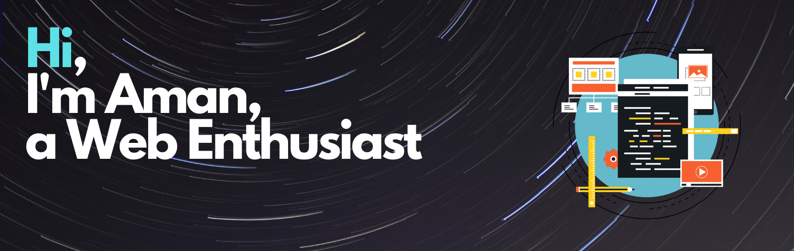

### 👨🏻‍💻 &nbsp;About Me:

💡 &nbsp;I like to solve CP problems for fun and explore Frontend web technologies.\
🎓 &nbsp;I'm currently studying Computer Science Engineering at IIIT, Nagpur.\
🌱 &nbsp;I'm on track for learning more about Backend Development, and get into Open Source.\
💬 &nbsp;Feel free to reach out to me for open source opportunities or working alogside a project.\
📄 &nbsp;Please have a look at my [Résumé](#) for more details about me.

 

### 🛠 &nbsp;Tech Stack:

&nbsp;
&nbsp;
&nbsp;
&nbsp;
&nbsp;
&nbsp;
&nbsp;
&nbsp;
\
&nbsp;
&nbsp;
&nbsp;
&nbsp;

 

### 🤝🏻 &nbsp; Find me at:

<!-- 

 -->

 
 

### 📈 Stats

 

 

